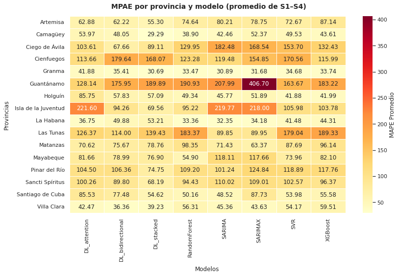
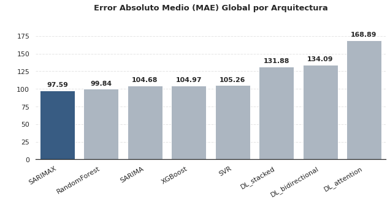
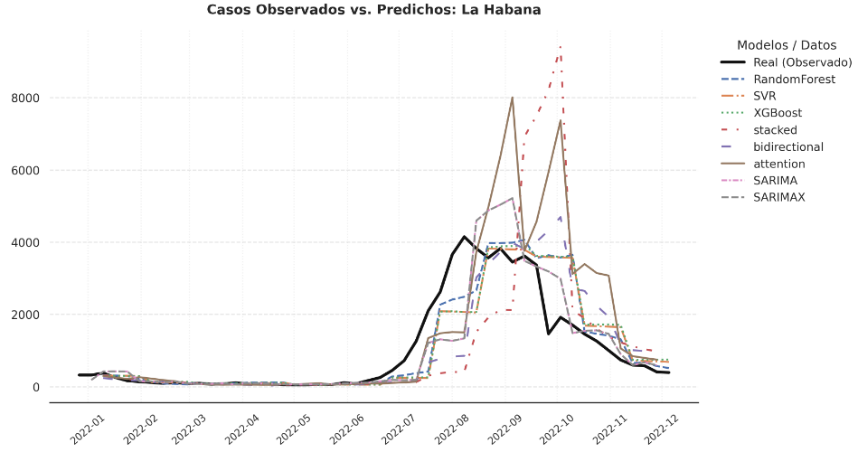

# Predicción de Arbovirosis en Cuba mediante Modelos de Series de Tiempo: Un Enfoque Comparativo por Provincias con Variables Climáticas (2014–2025)


Este repositorio contiene el framework computacional y el código fuente desarrollado para la tesis de graduación en Ciencia de Datos de la **Facultad de Matemática y Computación (MATCOM), Universidad de La Habana**.


El objetivo principal de la investigación es evaluar y comparar la capacidad predictiva de múltiples arquitecturas estadísticas, de Machine Learning y Deep Learning para el pronóstico de tasas de incidencia de dengue en las 15 provincias de Cuba y el Municipio Especial Isla de la Juventud, integrando variables macroclimáticas con ingeniería de rezagos temporal (lags).


---


## 📊 Descripción General del Proyecto


La propagación de arbovirosis como el dengue está fuertemente influenciada por dinámicas climáticas y socioambientales. Este estudio implementa un flujo de trabajo analítico integral que abarca desde la interpolación espacial de variables meteorológicas a través de polígonos de Thiessen hasta la validación cruzada mediante ventanas rodantes (*rolling window*) de horizontes múltiples ($S1$ a $S4$ semanas).


### Modelos Evaluados

*   **Modelos Estadísticos Clásicos:** SARIMA y SARIMAX (Modelos Autorregresivos Integrados de Media Móvil Estacionales con Variables Exógenas).

*   **Machine Learning (ML):** Support Vector Regression (SVR), Random Forest y Extreme Gradient Boosting (XGBoost) optimizados vía Optuna.

*   **Deep Learning (DL):** Redes de Memoria a Largo Corto Plazo (LSTM) en configuraciones *Stacked*, *Bidirectional* y basadas en mecanismos de *Attention*.

*   **Análisis de Parsimonia:** Evaluación formal de la relación compromiso entre la complejidad estructural de las arquitecturas y su ganancia marginal en precisión.


---


## 📂 Estructura del Repositorio


A raíz del proceso de modularización, el proyecto se encuentra estructurado bajo criterios de mantenibilidad y escalabilidad del software científico:


```text

DENGUE-TIME-SERIES-ANALYSIS/

├── data/                       # Almacenamiento de datasets (Raw y Processed)

├── src/                        # Núcleo modular del framework de simulación

│   ├── __init__.py             # Inicializador de paquetes de Python

│   ├── preprocessing/          # Módulos de limpieza e integración de datos climáticos

│   ├── evaluacion/             # Algoritmos de rolling window, métricas y parsimonia

│   └── visualizaciones/        # Funciones gráficas especializadas para reportes

├── outputs/                    # Subproductos de las ejecuciones experimentales

│   ├── tables/                 # Resultados métricos consolidados (MAE, RMSE, MAPE)

│   └── graficos/               # Gráficos de series, heatmaps y mapas generados

├── run_pipeline_completo.py    # Script maestro de preprocesamiento, análisis ACF y tuning

├── main_evaluate.py            # Script maestro de evaluación global y parsimonia

├── main_visualizaciones.py     # Script automatizado de exportación de gráficos de tesis

├── run_all.sh                  # Orquestador Bash para la ejecución del pipeline completo

└── README.md                   # Documentación principal

```


## Instalación


Este entorno requiere una instalación de Python 3.10 o superior.


### 1. Clonar el repositorio institucional


```bash
git clone https://github.com/Jennyfer2004/dengue-time-series-analysis.git

cd dengue-time-series-analysis
```


### 2. Instalar las dependencias de cómputo científico:


```bash
pip install pandas numpy geopandas matplotlib seaborn scikit-learn xgboost optuna statsmodels tensorflow shapely geovoronoi
```

## 🚀 Guía de Ejecución


El pipeline completo ha sido automatizado mediante un script en Bash que coordina la carga secuencial, el entrenamiento de modelos, la inferencia multietapa y la exportación de resultados.


### 1. Conceder permisos de ejecución al script maestro:


```bash
chmod +x run_all.sh
```

### 2. Ejecutar todo el proceso analítico:


```bash
./run_all.sh
```


### Fases Internas del Script:
* **`run_pipeline_completo.py`**: Limpia las bases de datos climáticas y epidemiológicas, calcula las autocorrelaciones parciales (PACF) para determinar retardos óptimos, y ejecuta el tuning de hiperparámetros.
* **`main_evaluate.py`**: Procesa la validación por ventanas rodantes para cada provincia bajo métricas estrictas y calcula las matrices de parsimonia.
* **`main_visualizaciones.py`**: Lee los resultados numéricos de las evaluaciones y genera automáticamente los mapas de error provinciales, mapas de calor agregados globales y las gráficas comparativas de valores reales contra predichos.


### 🖼️ Ejemplos de Visualizaciones Generadas


A continuación se muestran algunas de las visualizaciones principales generadas automáticamente por el framework:


#### 1. Comparativa Global de Errores (MAPE) por Provincia y Modelo




#### 2. Desempeño General por Arquitectura Predictiva (MAE Global)




#### 3. Ajuste de Predicciones frente a Casos Reales (Provincia: La Habana)


